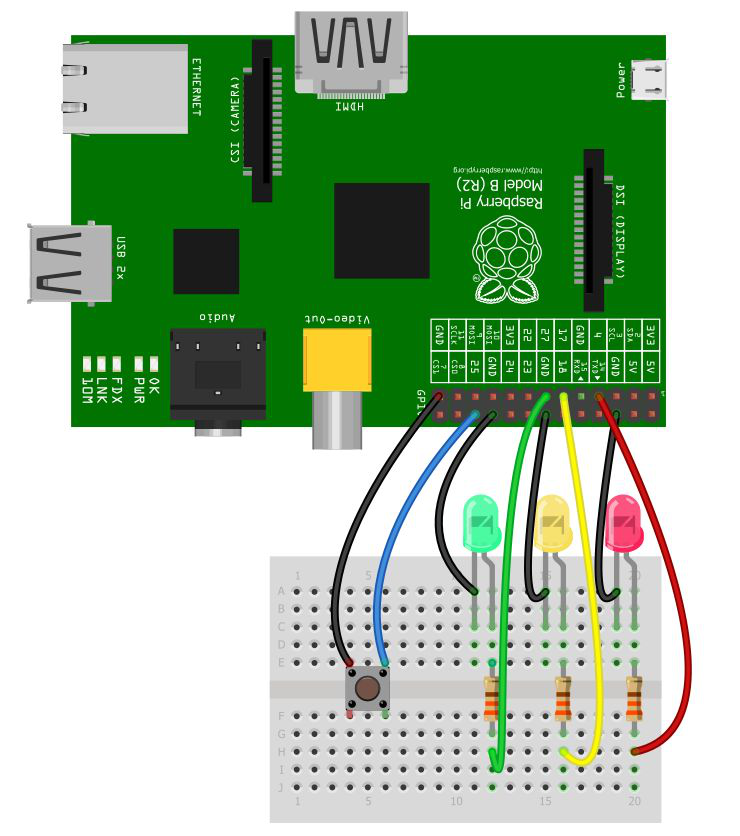

# eng-traffic-pi

This is a client project for a simple traffic light to tell your coworkers in
the office when it is ok to interupt you.

The idea is a RaspberryPi runs a wb server that this Ember app connects to via
socket.io. You then can control the traffic light and the corrisponding GPIO
pins toggle on the RaspberryPi.

The setup uses the
[Pi-GPIO-Server](https://github.com/projectweekend/Pi-GPIO-Server) project.
A simple LED setup like this diagram:



And this project configured to point to the Pi-GPIO-Server.

## Server Configuration

To help facilitate a better server client relationship the important values
that describe a _bulb_ are configured on the server. And because of the design
of the Pi-GPIO-Server there is only **one** configuration option we can use to
send over: **name**.

The client expects the following data in the **name** property of the server
pins' `config/pins.yml`. The format is expected to be a JSON string payload.

#### `name`

The name of the pin

#### `color`

A compatible CSS color value for this pin.

#### `order`

An optional number that can be used to order the lights when the client lists
them (ascending).

#### `description`

Description of the meaning for this pin.

### Example

For example if you wanted a traffic light then the server's `config/pins.yml`
might look like this:

```yaml
17:
  name: '{name:"Green Light",color:"#2ecc71",order:30,description:"Come on in and hang out. If the door is closed feel free to open it."}'
  mode: OUT
  initial: LOW
18:
  name: '{name:"Yellow Light",color:"#f1c40f",order:20,description:"Hard at work focusing. Inturupt if it is urgent or extreamly quick."}'
  mode: OUT
  initial: LOW
27:
  name: '{name:"Red Light",color:"#e74c3c",order:10,description:"In a meeting; do not disturb. Inturupt only if the site is down."}'
  mode: OUT
  initial: LOW
```

## Client Configuration

Client side settings are stored in `localStorage`. The initial defaults are
defined in `config/environment.js`.

#### `ENV.enableEasterEggs`

* **Default:** `true`
* **User customizable:** NO

If you do not which to include the [Konami
code](https://en.wikipedia.org/wiki/Konami_Code) Easter eggs you can set this
to false.

#### `ENV.APP.defaultTheme`

* **Default:** `standard`
* **User customizable:** YES

Sets the [hack.css](http://hackcss.com/) theme.

#### `ENV.APP.socketUrl`

* **Default:** `http://localhost:4200/` (dev) / `http://10.0.0.100:5000/` (prod)
* **User customizable:** YES

This is the socket.io URL to connect to. In development mode it is the same as
the ember server because there is a mock socket.io server that gets started
when you run `ember serve` for demo / development purposes. This should point
to your RaspberryPi's IP address (Pi-GPIO-Server defaults to port 5000) in
production.

## Prerequisites

You will need the following things properly installed on your computer.

* [Git](https://git-scm.com/)
* [Node.js](https://nodejs.org/) (with NPM)
* [Bower](https://bower.io/)
* [Ember CLI](https://ember-cli.com/)
* [PhantomJS](http://phantomjs.org/)

## Installation

* `git clone <repository-url>` this repository
* `cd eng-traffic-pi`
* `npm install`
* `bower install`

## Running / Development

* `ember serve`
* Visit your app at [http://localhost:4200](http://localhost:4200).

### Code Generators

Make use of the many generators for code, try `ember help generate` for more details

### Running Tests

* `ember test`
* `ember test --server`

### Building

* `ember build` (development)
* `ember build --environment production` (production)

### Deploying

Specify what it takes to deploy your app.

## Further Reading / Useful Links

* [ember.js](http://emberjs.com/)
* [ember-cli](https://ember-cli.com/)
* Development Browser Extensions
  * [ember inspector for chrome](https://chrome.google.com/webstore/detail/ember-inspector/bmdblncegkenkacieihfhpjfppoconhi)
  * [ember inspector for firefox](https://addons.mozilla.org/en-US/firefox/addon/ember-inspector/)
